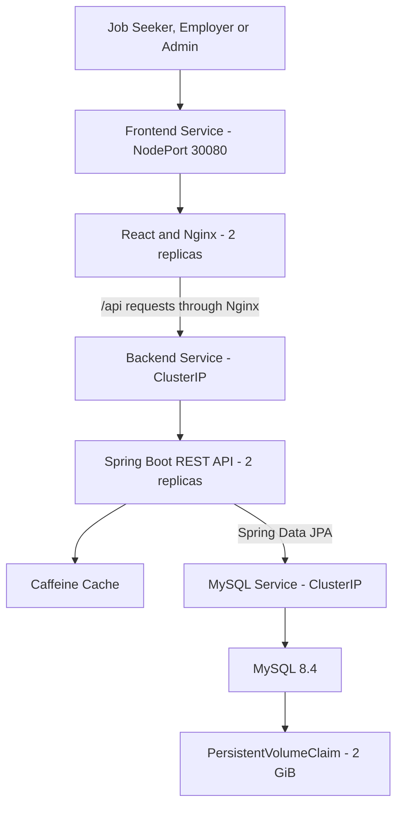

<div align="center">

# Job Portal

### Full-stack recruitment platform with containerized deployment and CI/CD

[](https://github.com/HungHayHo-IT/Job_Portal/actions/workflows/ci.yml)
[](https://github.com/HungHayHo-IT/Job_Portal/actions/workflows/publish-image.yml)


[Features](#features) •
[Architecture](#system-architecture) •
[Technology Stack](#technology-stack) •
[Docker](#run-with-docker-compose) •
[Kubernetes](#kubernetes-deployment) •
[CI/CD](#cicd-pipeline)

</div>

---

## Overview

Job Portal is a full-stack recruitment platform that connects job seekers, employers, and administrators.

The application provides job discovery, profile and resume management, job applications, employer recruitment workflows, company administration, and contact-message management through a responsive React interface and a secured Spring Boot REST API.

Besides implementing business requirements, this project demonstrates practical backend and DevOps skills:

* Layered and modular backend architecture
* RESTful API design
* JWT authentication and role-based authorization
* Database persistence with Spring Data JPA and MySQL
* Caching with Spring Cache and Caffeine
* Backend unit testing with JUnit 5 and Mockito
* Multi-stage Docker builds
* Docker Compose orchestration
* Continuous Integration with GitHub Actions
* Automated Docker image publishing to Docker Hub
* Kubernetes Deployments, Services, ConfigMap, Secret, probes, resources, and persistent storage

> The application is designed as a modular monolith. This keeps the system suitable for a portfolio-scale project while maintaining clear separation between business modules.

---

## Key Highlights

* Complete recruitment workflow for three user roles
* Stateless JWT authentication
* BCrypt password hashing
* Role-based frontend routes and backend authorization
* Profile picture and resume upload/download
* Job-saving and application-tracking functionality
* API documentation with Swagger/OpenAPI
* Configurable Caffeine caching
* Spring Boot Actuator health monitoring
* Centralized exception handling and request validation
* Custom MySQL image with automatic schema and seed-data initialization
* Multi-stage and non-root backend Docker image
* Automated backend tests, frontend linting, and production builds
* Automated versioned image publishing to Docker Hub
* Two frontend and two backend replicas on Kubernetes
* Rolling updates with zero unavailable backend/frontend pods
* Kubernetes startup, readiness, and liveness probes
* Persistent MySQL storage using a PersistentVolumeClaim

---

## Features

### Public users

* Browse available jobs
* Browse companies
* View job and company details
* Search and filter job opportunities
* Register a job seeker account
* Log in securely
* Submit contact messages
* Use a responsive light/dark interface

### Job seekers

* Create and update a personal profile
* Upload a profile picture
* Upload and download a resume
* Save jobs
* Remove jobs from the saved list
* Apply for jobs with a cover letter
* Withdraw submitted applications
* View applied jobs
* Track application status

### Employers

* Create job postings
* View their posted jobs
* Update job status
* Open or close job postings
* View applicants for a job
* Review applicant information and resumes
* Update application status

### Administrators

* Access an administrative dashboard
* Create, update, and delete companies
* Search users by email
* Promote users to the employer role
* Assign employers to companies
* View and manage contact messages
* Use pagination and sorting for administrative data

---

## System Architecture



### Request flow

1. A user accesses the React single-page application.
2. Nginx serves the compiled frontend files.
3. Requests under `/api/*` are reverse-proxied to the backend.
4. Spring Security validates the JWT and checks the user's role.
5. The backend executes business logic through the service layer.
6. Spring Data JPA communicates with MySQL.
7. Frequently requested jobs, companies, and roles can be served from Caffeine cache.
8. MySQL data is stored in a Docker volume or Kubernetes PersistentVolumeClaim.

Docker Compose and Kubernetes use the same application flow. Docker Compose provides service discovery through container names, while Kubernetes uses ClusterIP Services.

---

## Backend Architecture

The backend follows a layered architecture:

```text
Controller
    ↓
Service
    ↓
Repository
    ↓
MySQL
```

The main backend modules include:

* Authentication
* Security
* Users and profiles
* Companies
* Jobs
* Job applications
* Saved jobs
* Contact messages
* Caching
* Auditing and logging
* Exception handling

DTOs and mapper classes are used to separate API contracts from database entities.

### Main domain entities

* `JobPortalUser`
* `Role`
* `Profile`
* `Company`
* `Job`
* `JobApplication`
* `Contact`

---

## Technology Stack

| Area             | Technologies                                           |
| ---------------- | ------------------------------------------------------ |
| Frontend         | React 19, Vite 7, React Router                         |
| Styling          | Tailwind CSS, Font Awesome, Lucide React               |
| HTTP client      | Axios                                                  |
| State management | React Context API                                      |
| Backend          | Java 17, Spring Boot 3.2.4                             |
| REST API         | Spring Web, Bean Validation                            |
| Security         | Spring Security, JWT, BCrypt, CORS, CSRF configuration |
| Persistence      | Spring Data JPA, Hibernate                             |
| Database         | MySQL 8.4                                              |
| Caching          | Spring Cache, Caffeine                                 |
| Documentation    | Springdoc OpenAPI, Swagger UI                          |
| Testing          | JUnit 5, Mockito, Spring Boot Test                     |
| Observability    | Spring Boot Actuator, OTLP-ready configuration         |
| Web server       | Nginx                                                  |
| Containers       | Docker, Docker Compose                                 |
| CI and delivery  | GitHub Actions, Docker Buildx, Docker Hub              |
| Orchestration    | Kubernetes, Kind                                       |

---

## Project Structure

```text
Job_Portal/
├── .github/
│   └── workflows/
│       ├── ci.yml
│       └── publish-image.yml
│
├── JobPortal/
│   ├── BE/
│   │   ├── src/main/java/com/example/BE/
│   │   │   ├── auth/
│   │   │   ├── cache/
│   │   │   ├── company/
│   │   │   ├── contact/
│   │   │   ├── dto/
│   │   │   ├── entity/
│   │   │   ├── exception/
│   │   │   ├── job/
│   │   │   ├── repository/
│   │   │   ├── security/
│   │   │   └── user/
│   │   ├── src/main/resources/
│   │   │   └── sql/
│   │   │       ├── 01-schema.sql
│   │   │       ├── 02-data.sql
│   │   │       └── Dockerfile.mysql
│   │   ├── src/test/
│   │   ├── Dockerfile
│   │   └── pom.xml
│   │
│   ├── FE/
│   │   ├── public/
│   │   ├── src/
│   │   │   ├── components/
│   │   │   ├── config/
│   │   │   ├── context/
│   │   │   ├── pages/
│   │   │   └── services/
│   │   ├── Dockerfile
│   │   ├── nginx.conf
│   │   └── package.json
│   │
│   ├── k8s/
│   │   ├── namespace.yaml
│   │   ├── configmap.yaml
│   │   ├── secret.example.yaml
│   │   ├── mysql-pvc.yaml
│   │   ├── mysql-deployment.yaml
│   │   ├── mysql-service.yaml
│   │   ├── backend-deployment.yaml
│   │   ├── backend-service.yaml
│   │   ├── frontend-deployment.yaml
│   │   └── frontend-service.yaml
│   │
│   ├── .env.example
│   └── docker-compose.yml
│
├── kind-config.yaml
└── README.md
```

---

## Run with Docker Compose

Docker Compose is the fastest way to run the complete application.

### Prerequisites

* Git
* Docker Desktop
* Docker Compose v2

### 1. Clone the repository

```bash
git clone https://github.com/HungHayHo-IT/Job_Portal.git
cd Job_Portal/JobPortal
```

### 2. Create the environment file

Windows PowerShell:

```powershell
Copy-Item .env.example .env
notepad .env
```

macOS, Linux, or Git Bash:

```bash
cp .env.example .env
```

Update `.env` with your own values:

```env
MYSQL_ROOT_PASSWORD=your-secure-root-password
DB_USERNAME=jobportal
DB_PASSWORD=your-secure-database-password
JWT_SECRET=your-long-random-jwt-secret-at-least-32-characters
```

Do not commit the real `.env` file.

### 3. Start the complete application

```bash
docker compose up --build -d
```

The first startup can take several minutes because Docker needs to:

* Download the required base images
* Build the frontend and backend images
* Build the custom MySQL image
* Create the database volume
* Import the database schema and seed data
* Wait for MySQL and the backend health checks

### 4. Verify the containers

```bash
docker compose ps
```

Expected services:

| Service         | Address                                     | Purpose                           |
| --------------- | ------------------------------------------- | --------------------------------- |
| Frontend        | http://localhost                            | React application served by Nginx |
| Backend         | http://localhost:8082                       | Spring Boot REST API              |
| Swagger UI      | http://localhost:8082/swagger-ui/index.html | API documentation                 |
| Actuator health | http://localhost:8082/actuator/health       | Backend health                    |
| MySQL           | `localhost:3308`                            | Local database connection         |

### 5. View logs

All services:

```bash
docker compose logs -f
```

Individual services:

```bash
docker compose logs -f mysql
docker compose logs -f backend
docker compose logs -f frontend
```

### 6. Stop the application

```bash
docker compose down
```

Remove the containers and local database volume:

```bash
docker compose down -v
```

> `docker compose down -v` permanently removes the database data stored in the Docker volume.

---

## Database Initialization

The project uses a custom MySQL 8.4 image.

During the first startup, MySQL automatically executes:

```text
01-schema.sql
02-data.sql
```

These scripts are copied to:

```text
/docker-entrypoint-initdb.d/
```

The database initialization only runs when the MySQL data volume is empty.

If the SQL scripts are changed and the database needs to be initialized again:

```bash
docker compose down -v
docker compose up --build -d
```

---

## API Documentation

After starting the backend, open Swagger UI:

```text
http://localhost:8082/swagger-ui/index.html
```

OpenAPI specification:

```text
http://localhost:8082/v3/api-docs
```

### Main API groups

| Base path           | Responsibility                                              |
| ------------------- | ----------------------------------------------------------- |
| `/api/v1/auth`      | Registration and authentication                             |
| `/api/v1/companies` | Public and administrative company operations                |
| `/api/v1/jobs`      | Employer jobs and job applications                          |
| `/api/v1/users`     | Profiles, saved jobs, applications, and user administration |
| `/api/v1/contacts`  | Contact requests and message management                     |

---

## Security

The application uses Spring Security with JWT-based authentication.

Security features include:

* JWT generation after successful authentication
* JWT validation for protected requests
* Role-based access control
* BCrypt password hashing
* Protected React routes
* Configurable CORS policy
* CSRF-related configuration
* Jakarta Bean Validation
* Centralized exception handling
* Secrets supplied through environment variables or Kubernetes Secrets

### Authorization roles

| Role              | Main permissions                                            |
| ----------------- | ----------------------------------------------------------- |
| `ROLE_JOB_SEEKER` | Manage profile, save jobs, apply, and withdraw applications |
| `ROLE_EMPLOYER`   | Create jobs, manage job status, and review applicants       |
| `ROLE_ADMIN`      | Manage companies, users, employers, and contact messages    |

Sensitive files are ignored by Git:

```text
.env
secret.yaml
secret.yml
*-secret.yaml
*-secret.yml
```

Only example configuration files are committed.

---

## Caching

The backend uses Spring Cache with Caffeine.

Configured caches include:

| Cache     |        TTL | Maximum entries |
| --------- | ---------: | --------------: |
| Jobs      | 10 minutes |           5,000 |
| Companies | 10 minutes |             500 |
| Roles     |      1 day |             100 |

Caching reduces repeated database queries while keeping the application infrastructure simple.

---

## Running Tests

### Backend

macOS, Linux, or Git Bash:

```bash
cd JobPortal/BE
./mvnw verify
```

Windows PowerShell:

```powershell
cd JobPortal/BE
.\mvnw.cmd verify
```

The backend uses:

* Spring Boot Test
* JUnit 5
* Mockito
* MySQL during GitHub Actions CI

### Frontend lint

```bash
cd JobPortal/FE
npm ci
npm run lint
```

### Frontend production build

```bash
npm run build
```

---

## Docker Design

### Backend image

The backend uses a multi-stage build:

1. Maven Wrapper builds the Spring Boot application with Java 17.
2. The generated JAR is copied into a smaller Java 17 JRE image.
3. The application runs using a non-root user.
4. JVM container memory usage is limited through `MaxRAMPercentage`.
5. Actuator is used for the container health check.

### Frontend image

The frontend also uses a multi-stage build:

1. Node.js 20 installs dependencies with `npm ci`.
2. ESLint validates the frontend source.
3. Vite creates the production bundle.
4. Nginx serves the compiled static files.
5. Nginx reverse-proxies `/api/*` to the backend.
6. `/health` is provided for container and Kubernetes probes.

### MySQL image

The MySQL image:

* Extends `mysql:8.4`
* Includes schema and seed-data scripts
* Persists its data using a Docker volume or Kubernetes PVC

---

## Kubernetes Deployment

The project can be deployed to a local Kind cluster using the provided declarative Kubernetes manifests.

### Kubernetes resources

| Resource              | Purpose                                        |
| --------------------- | ---------------------------------------------- |
| Namespace             | Isolates all Job Portal resources              |
| ConfigMap             | Stores non-sensitive application configuration |
| Secret                | Stores database passwords and JWT secret       |
| PersistentVolumeClaim | Requests 2 GiB for MySQL data                  |
| MySQL Deployment      | Runs one MySQL pod                             |
| Backend Deployment    | Runs two Spring Boot pods                      |
| Frontend Deployment   | Runs two React/Nginx pods                      |
| ClusterIP Services    | Provide internal backend and MySQL access      |
| NodePort Service      | Exposes the frontend on port `30080`           |

### Deployment architecture

* Frontend replicas: `2`
* Backend replicas: `2`
* MySQL replicas: `1`
* Frontend NodePort: `30080`
* Backend port: `8082`
* MySQL port: `3306`
* MySQL storage: `2 GiB`

The backend and frontend use `RollingUpdate` with:

```yaml
maxUnavailable: 0
maxSurge: 1
```

MySQL uses the `Recreate` strategy because it mounts a single `ReadWriteOnce` volume.

---

## Deploy to Kind

### Prerequisites

* Docker Desktop
* Kind
* kubectl

Verify the tools:

```bash
docker version
kind version
kubectl version --client
```

### 1. Clone the repository

```bash
git clone https://github.com/HungHayHo-IT/Job_Portal.git
cd Job_Portal
```

### 2. Create the Kind cluster

The provided `kind-config.yaml` maps the Kubernetes NodePort `30080` to port `30080` on the local machine.

```bash
kind create cluster --name jobportal --config kind-config.yaml
```

Verify the cluster:

```bash
kind get clusters
kubectl cluster-info --context kind-jobportal
```

### 3. Build the custom MySQL image

```bash
docker build \
  -t jobportal-mysql:8.4 \
  JobPortal/BE/src/main/resources/sql
```

Windows PowerShell can run the same command on one line:

```powershell
docker build -t jobportal-mysql:8.4 JobPortal/BE/src/main/resources/sql
```

### 4. Load the MySQL image into Kind

```bash
kind load docker-image jobportal-mysql:8.4 --name jobportal
```

The backend and frontend images are pulled from Docker Hub:

```text
hunghayho/job-portal-backend:v1.0.1
hunghayho/job-portal-frontend:v1.0.1
```

### 5. Create a local Kubernetes Secret

Windows PowerShell:

```powershell
Copy-Item JobPortal/k8s/secret.example.yaml JobPortal/k8s/secret.yaml
notepad JobPortal/k8s/secret.yaml
```

macOS, Linux, or Git Bash:

```bash
cp JobPortal/k8s/secret.example.yaml JobPortal/k8s/secret.yaml
```

Replace the example values:

```yaml
stringData:
  MYSQL_ROOT_PASSWORD: your-secure-root-password
  DB_PASSWORD: your-secure-database-password
  JWT_SECRET: your-long-random-jwt-secret-at-least-32-characters
```

Do not commit `secret.yaml`.

### 6. Apply Kubernetes manifests

Create the namespace and configuration:

```bash
kubectl apply -f JobPortal/k8s/namespace.yaml
kubectl apply -f JobPortal/k8s/configmap.yaml
kubectl apply -f JobPortal/k8s/secret.yaml
```

Deploy MySQL:

```bash
kubectl apply -f JobPortal/k8s/mysql-pvc.yaml
kubectl apply -f JobPortal/k8s/mysql-service.yaml
kubectl apply -f JobPortal/k8s/mysql-deployment.yaml
```

Deploy the backend:

```bash
kubectl apply -f JobPortal/k8s/backend-service.yaml
kubectl apply -f JobPortal/k8s/backend-deployment.yaml
```

Deploy the frontend:

```bash
kubectl apply -f JobPortal/k8s/frontend-service.yaml
kubectl apply -f JobPortal/k8s/frontend-deployment.yaml
```

### 7. Verify the deployment

```bash
kubectl get all -n jobportal
kubectl get pvc -n jobportal
kubectl get configmap -n jobportal
kubectl get secret -n jobportal
```

Watch pods until they are ready:

```bash
kubectl get pods -n jobportal -w
```

Expected result:

```text
jobportal-mysql      1/1 Running
jobportal-backend    1/1 Running
jobportal-backend    1/1 Running
jobportal-frontend   1/1 Running
jobportal-frontend   1/1 Running
```

### 8. Check rollout status

```bash
kubectl rollout status deployment/jobportal-mysql -n jobportal
kubectl rollout status deployment/jobportal-backend -n jobportal
kubectl rollout status deployment/jobportal-frontend -n jobportal
```

### 9. Open the application

```text
http://localhost:30080
```

If NodePort access is unavailable, use port forwarding:

```bash
kubectl port-forward \
  -n jobportal \
  service/jobportal-frontend \
  8080:80
```

Then open:

```text
http://localhost:8080
```

### 10. View Kubernetes logs

```bash
kubectl logs -n jobportal deployment/jobportal-mysql
kubectl logs -n jobportal deployment/jobportal-backend
kubectl logs -n jobportal deployment/jobportal-frontend
```

### 11. Restart a deployment

```bash
kubectl rollout restart deployment/jobportal-backend -n jobportal
kubectl rollout restart deployment/jobportal-frontend -n jobportal
```

### 12. Remove the cluster

```bash
kind delete cluster --name jobportal
```

---

## Kubernetes Reliability Configuration

### Startup probes

Startup probes allow MySQL and the Spring Boot backend enough time to initialize before Kubernetes begins checking liveness.

### Readiness probes

Readiness probes prevent traffic from being sent to containers that are not ready.

Backend readiness endpoint:

```text
/actuator/health
```

Frontend readiness endpoint:

```text
/health
```

### Liveness probes

Liveness probes allow Kubernetes to restart unhealthy containers automatically.

### Resource management

Resources are configured for every component:

| Component | CPU request | CPU limit | Memory request | Memory limit |
| --------- | ----------: | --------: | -------------: | -----------: |
| Frontend  |         50m |      250m |         64 MiB |      256 MiB |
| Backend   |        150m |      750m |        256 MiB |      768 MiB |
| MySQL     |        250m |     1 CPU |        512 MiB |        1 GiB |

---

## CI/CD Pipeline

The project contains two GitHub Actions workflows.

### Continuous Integration

Workflow:

```text
.github/workflows/ci.yml
```

It runs on:

* Pull requests targeting `main`
* Pushes to `main`
* Manual execution

CI stages:

1. Start a MySQL 8.4 service container.
2. Set up Java 17.
3. Restore the Maven dependency cache.
4. Run backend tests with `mvn verify`.
5. Set up Node.js 20.
6. Restore the npm dependency cache.
7. Install dependencies using `npm ci`.
8. Run ESLint.
9. Build the React production bundle.
10. Build backend and frontend Docker images.

The Docker build job runs only after the backend and frontend jobs succeed.

### Docker image delivery

Workflow:

```text
.github/workflows/publish-image.yml
```

It runs on:

* Pushes to `main`
* Semantic version tags such as `v1.0.1`
* Manual execution

The workflow:

1. Authenticates with Docker Hub.
2. Configures Docker Buildx.
3. Generates Docker image metadata.
4. Builds the backend and frontend images.
5. Uses GitHub Actions cache.
6. Pushes the images to Docker Hub.

Generated image tags include:

* `latest`
* Branch name
* Commit SHA, for example `sha-a1b2c3d`
* Semantic version, for example `v1.0.1`

### Docker Hub images

* [hunghayho/job-portal-backend](https://hub.docker.com/r/hunghayho/job-portal-backend)
* [hunghayho/job-portal-frontend](https://hub.docker.com/r/hunghayho/job-portal-frontend)

### Required GitHub configuration

| Type                | Name                 | Purpose                 |
| ------------------- | -------------------- | ----------------------- |
| Repository variable | `DOCKERHUB_USERNAME` | Docker Hub username     |
| Repository secret   | `DOCKERHUB_TOKEN`    | Docker Hub access token |

> GitHub Actions automatically tests, builds, and publishes container images. Kubernetes deployment is currently performed manually using declarative YAML manifests.

---

## Release Workflow

To create a versioned release:

```bash
git tag -a v1.0.1 -m "Release Job Portal v1.0.1"
git push origin v1.0.1
```

Pushing the tag starts the Docker image publishing workflow and creates images tagged with the semantic version.

Example:

```text
hunghayho/job-portal-backend:v1.0.1
hunghayho/job-portal-frontend:v1.0.1
```

---

## Health Checks and Observability

Backend health endpoint:

```text
GET /actuator/health
```

Frontend health endpoint:

```text
GET /health
```

The project includes:

* Spring Boot Actuator
* Docker health checks
* Kubernetes startup probes
* Kubernetes readiness probes
* Kubernetes liveness probes
* Configurable application logging
* OTLP-ready metrics, traces, and logs configuration

---

## Engineering Decisions

### Why a modular monolith?

For a portfolio-scale recruitment system, a modular monolith provides:

* Simpler development
* Simpler deployment
* Clear business-module separation
* Easier debugging and testing
* Lower infrastructure overhead
* A practical foundation for future service extraction

### Why Nginx?

Nginx serves the frontend production bundle and reverse-proxies API requests to the backend, allowing the browser to access the UI and API through the same origin.

### Why Docker Compose?

Docker Compose provides a reproducible local environment containing the frontend, backend, and database with one command.

### Why Kubernetes?

The Kubernetes configuration demonstrates:

* Declarative deployment
* Multiple application replicas
* Internal service discovery
* Rolling updates
* Self-healing health probes
* Resource requests and limits
* Configuration and secret separation
* Persistent database storage

### Why Kind?

Kind creates a local Kubernetes cluster using Docker containers. It is lightweight and suitable for development, testing, demonstrations, and learning Kubernetes without requiring a cloud account.

---

## Future Improvements

Potential production improvements include:

* Deploying to a public cloud platform
* Adding HTTPS and an Ingress Controller
* Using a managed MySQL database
* Using a cloud secret manager
* Adding Testcontainers integration tests
* Adding frontend component and end-to-end tests
* Adding Prometheus and Grafana dashboards
* Adding centralized log collection
* Adding dependency and container vulnerability scanning
* Automatically deploying a selected image version to Kubernetes

---

## Author

**Hùng – Java Backend Developer**

* GitHub: [@HungHayHo-IT](https://github.com/HungHayHo-IT)
* Repository: [HungHayHo-IT/Job_Portal](https://github.com/HungHayHo-IT/Job_Portal)

---

<div align="center">

Built to demonstrate full-stack development, Java backend engineering, Docker, CI/CD, and Kubernetes deployment.

If you find this project useful, consider giving it a ⭐.

</div>

