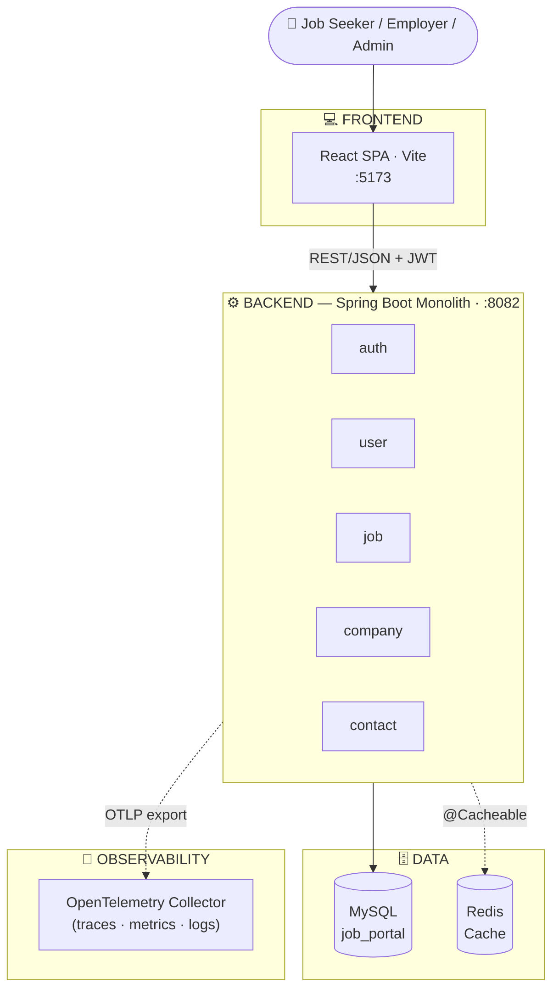

# 💼 Job Portal

Nền tảng tuyển dụng trực tuyến (job board) gồm **backend Spring Boot monolith** (kiến trúc phân lớp theo domain) và **frontend React SPA**, hỗ trợ 3 vai trò: **Job Seeker** (ứng viên), **Employer** (nhà tuyển dụng) và **Admin**.

> Dự án cá nhân phục vụ mục đích học tập và làm portfolio cho vị trí **Fresher Java Backend Developer**.

<p align="left">
  
  
  
  
  
  
</p>

---

## 📖 Mục lục

- [Tổng quan](#-tổng-quan)
- [Kiến trúc hệ thống](#-kiến-trúc-hệ-thống)
- [Công nghệ sử dụng](#-công-nghệ-sử-dụng)
- [Tính năng chính](#-tính-năng-chính)
- [API Endpoints](#-api-endpoints)
- [Bắt đầu nhanh](#-bắt-đầu-nhanh)
- [Biến môi trường](#-biến-môi-trường)
- [Cấu trúc thư mục](#-cấu-trúc-thư-mục)
- [Roadmap](#-roadmap)
- [Tác giả](#-tác-giả)

---

## 🎯 Tổng quan

**Job Portal** là hệ thống hai phần tách biệt:

- **Backend (`BE`)** — Spring Boot monolith tổ chức theo **domain package** (mỗi domain có `controller/service/mapper/impl` riêng), xác thực bằng **JWT**, phân quyền theo 3 role (`ADMIN`, `EMPLOYER`, `JOB_SEEKER`), có **cache Redis**, **AOP logging/audit**, và xuất **traces/metrics/logs qua OpenTelemetry**.
- **Frontend (`FE`)** — React 19 + Vite SPA, quản lý state với Redux Toolkit, giao tiếp REST qua Axios, styling bằng Tailwind CSS 4.

## 🏗 Kiến trúc hệ thống



**Cách đọc sơ đồ:** Frontend gọi thẳng vào backend qua REST (không qua service riêng vì đây là monolith). Trong backend, các domain (`auth`, `user`, `job`, `company`, `contact`) là các package độc lập nhưng dùng chung một database MySQL. Redis đóng vai trò cache tăng tốc đọc dữ liệu (job list, company list...). OpenTelemetry Collector là thành phần tùy chọn để quan sát hệ thống khi cần.

## 🛠 Công nghệ sử dụng

| Nhóm | Công nghệ |
|---|---|
| **Backend Framework** | Java, Spring Boot 3 (Web, Data JPA, Security, Validation, AOP, Cache, Actuator) |
| **Bảo mật** | Spring Security, JWT (JJWT), CSRF protection, CORS config |
| **Cơ sở dữ liệu** | MySQL 8, Spring Data JPA/Hibernate |
| **Cache** | Redis (`spring-boot-starter-data-redis`), Caffeine (in-memory cache) |
| **Observability** | Spring Actuator, OpenTelemetry (OTLP export cho traces/metrics/logs) |
| **API Docs** | springdoc-openapi (Swagger UI) |
| **Khác (BE)** | Lombok, Jackson, AOP (logging & audit aspect) |
| **Frontend** | React 19, Vite, Redux Toolkit, React Router 7 |
| **UI/Styling** | Tailwind CSS 4, Lucide Icons, FontAwesome |
| **Giao tiếp API** | Axios, js-cookie |
| **UX phụ trợ** | React Toastify (thông báo) |

## ✨ Tính năng chính

### 🧾 Chức năng nghiệp vụ (Functional)

**Xác thực** (`/api/v1/auth`)
- Đăng ký, đăng nhập với JWT (`/register/public`, `/login/public`)

**Job Seeker** (`/api/v1/users`)
- Xem & cập nhật hồ sơ cá nhân, ảnh đại diện, CV (resume)
- Lưu / bỏ lưu tin tuyển dụng yêu thích, xem danh sách đã lưu
- Ứng tuyển việc làm, rút đơn ứng tuyển, xem danh sách đơn đã nộp

**Employer** (`/api/v1/jobs`)
- Đăng tin tuyển dụng, xem danh sách tin của mình, cập nhật trạng thái tin (mở/đóng)
- Xem danh sách ứng viên đã ứng tuyển vào từng tin
- Duyệt / từ chối đơn ứng tuyển

**Company** (`/api/v1/companies`)
- Xem danh sách công ty công khai
- Admin: tạo, sửa, xoá thông tin công ty

**Contact** (`/api/v1/contacts`)
- Gửi liên hệ/góp ý công khai
- Admin: xem, sắp xếp, phân trang, cập nhật trạng thái xử lý liên hệ

**Admin — Quản trị người dùng** (`/api/v1/users`)
- Tìm kiếm người dùng có vai trò Employer
- Nâng quyền user thành Employer, gán Employer vào Company

### ⚙️ Yêu cầu phi chức năng (Non-Functional)

| Thuộc tính | Cách hiện thực trong dự án |
|---|---|
| **Bảo mật (Security)** | JWT stateless auth + `JwtTokenValidatorFilter`; phân quyền theo route bằng `hasRole()` cho `ADMIN` / `EMPLOYER` / `JOB_SEEKER` (khai báo tập trung tại `PathConfig`); CSRF endpoint riêng; CORS whitelist origin FE |
| **Hiệu năng (Performance)** | Redis cache theo từng nhóm dữ liệu với TTL riêng: `employerJobs` (15p), `jobApplications` (5p), `jobDetail` (1h), `companiesCache` (12h); Caffeine cho cache in-memory ngắn hạn |
| **Khả năng quan sát (Observability)** | Spring Actuator (health, metrics, env, configprops); export traces/metrics/logs qua OpenTelemetry Collector (OTLP) |
| **Truy vết & kiểm toán (Auditing)** | JPA Auditing tự động điền `createdAt/updatedAt/createdBy/updatedBy` qua `AuditorAwareImpl`; AOP ghi log đăng nhập thành công (`LoginSuccessAuditAspect`) và audit exception (`ExceptionAuditAspect`) |
| **Logging có cấu trúc** | AOP đo hiệu năng & log method (`LoggingAndPerformanceAspect`, `LogAspect`), log console có màu theo mức độ |
| **Validation** | Bean Validation (`@Valid`) kết hợp AOP validate khi đăng ký (`RegisterValidationAspect`) |
| **Khả năng triển khai (Deployability)** | Tách biệt BE/FE, cấu hình qua `application.properties` + biến môi trường, sẵn `spring-boot-docker-compose` support |

## 📚 API Endpoints

Swagger UI: `http://localhost:8082/swagger-ui.html` (sau khi chạy backend)

```
POST   /api/v1/auth/register/public
POST   /api/v1/auth/login/public

GET    /api/v1/users/profile/jobseeker
PUT    /api/v1/users/profile/jobseeker
GET    /api/v1/users/profile/picture/jobseeker
GET    /api/v1/users/profile/resume/jobseeker
GET    /api/v1/users/saved-jobs/jobseeker
POST   /api/v1/users/saved-jobs/{jobId}/jobseeker
DELETE /api/v1/users/saved-jobs/{jobId}/jobseeker
GET    /api/v1/users/job-applications/jobseeker
POST   /api/v1/users/job-applications/jobseeker
DELETE /api/v1/users/job-applications/{jobId}/jobseeker
GET    /api/v1/users/search/admin
PATCH  /api/v1/users/{userId}/role/employer/admin
PATCH  /api/v1/users/{userId}/company/{companyId}/admin

GET    /api/v1/jobs/employer
POST   /api/v1/jobs/employer
PATCH  /api/v1/jobs/{jobId}/status/employer
GET    /api/v1/jobs/applications/{jobId}/employer
PATCH  /api/v1/jobs/applications/employer

GET    /api/v1/companies/public
GET    /api/v1/companies/admin
POST   /api/v1/companies/admin
PUT    /api/v1/companies/{id}/admin
DELETE /api/v1/companies/{id}/admin

POST   /api/v1/contacts/public
GET    /api/v1/contacts/admin
GET    /api/v1/contacts/sort/admin
GET    /api/v1/contacts/page/admin
PATCH  /api/v1/contacts/{id}/status/admin
```

> Ghi chú: hiện backend chưa có endpoint public để **tìm kiếm/liệt kê job cho ứng viên** (mới có API phía Employer quản lý job của họ) — đây là điểm nên bổ sung sớm, xem [Roadmap](#-roadmap).

## 🚀 Bắt đầu nhanh

### Yêu cầu
- JDK 17+, Maven (đi kèm `mvnw`)
- Node.js 18+ & npm
- MySQL 8, Redis

### Chạy Backend

```bash
cd JobPortal/BE

# Tạo database MySQL tên "job_portal" trước, mặc định BE nối tới:
# jdbc:mysql://localhost:3308/job_portal (đổi lại port 3306 nếu dùng MySQL local mặc định)

./mvnw spring-boot:run
```

Backend chạy tại `http://localhost:8082`, Swagger UI tại `/swagger-ui.html`, Actuator tại `/actuator`.

### Chạy Frontend

```bash
cd JobPortal/FE
npm install
npm run dev
```

Frontend chạy tại `http://localhost:5173` (đã cấu hình CORS khớp ở backend).

> File `docker-compose.yml` ở gốc dự án hiện đang **để trống** — nên bổ sung cấu hình MySQL + Redis (+ tuỳ chọn OpenTelemetry Collector) để người khác chạy toàn bộ hệ thống bằng một lệnh `docker compose up`, thay vì phải cài MySQL/Redis thủ công.

## 🔐 Biến môi trường

Backend hiện đọc cấu hình trực tiếp từ `application.properties`. Khuyến nghị tách các giá trị nhạy cảm ra biến môi trường trước khi public repo:

| Biến | Mô tả | Giá trị mặc định hiện tại |
|---|---|---|
| `SPRING_DATASOURCE_URL` | Kết nối MySQL | `jdbc:mysql://localhost:3308/job_portal` |
| `SPRING_DATASOURCE_USERNAME` | User MySQL | `root` |
| `SPRING_DATASOURCE_PASSWORD` | Mật khẩu MySQL | ⚠️ đang hardcode trong `application.properties`, nên chuyển sang biến môi trường / `.env` |
| `SPRING_DATA_REDIS_HOST` / `PORT` | Kết nối Redis | `localhost` / `6379` |
| `APP_CORS_ALLOWED_ORIGINS` | Origin FE được phép gọi API | `http://localhost:5173` |

> Ngoài ra, `management.endpoints.web.exposure.include=*` cùng `show-values=always` đang expose **toàn bộ** endpoint Actuator (bao gồm cả biến môi trường, config) — phù hợp khi dev local nhưng **cần giới hạn lại** (ví dụ chỉ `health,info`) trước khi deploy production để tránh lộ thông tin cấu hình.

## 📁 Cấu trúc thư mục

```
Job_Portal/
└── JobPortal/
    ├── BE/                         # Spring Boot backend
    │   └── src/main/java/com/example/BE/
    │       ├── auth/               # Đăng ký / đăng nhập, JWT
    │       ├── user/               # Job seeker profile, saved jobs, applications
    │       ├── job/                # Employer job management
    │       ├── company/            # Company CRUD
    │       ├── contact/            # Contact form
    │       ├── security/           # SecurityConfig, JWT filter, CORS, path config
    │       ├── cache/               # Redis config & candidate activity cache
    │       ├── aspects/ audit/     # AOP logging, audit, validation
    │       ├── entity/             # JPA entities (BaseEntity auditing chung)
    │       ├── dto/                # Request/Response DTO
    │       └── exception/          # Global exception handler
    ├── FE/                         # React + Vite frontend
    │   └── src/
    │       ├── pages/               # Home, Jobs, JobDetail, Profile, admin/...
    │       ├── components/          # UI components dùng lại
    │       ├── services/             # Gọi API (companyService, jobApplicationService...)
    │       ├── contexts/ context/    # React Context
    │       └── config/               # Cấu hình FE (baseURL API...)
    └── docker-compose.yml           # (đang trống — cần bổ sung)
```

## 🗺 Roadmap

- [ ] Bổ sung API **public** tìm kiếm & lọc job cho Job Seeker (hiện chỉ có API phía Employer)
- [ ] Hoàn thiện `docker-compose.yml` (MySQL + Redis + BE + FE) để chạy one-command
- [ ] Chuyển toàn bộ secret (DB password, JWT key) sang biến môi trường / `.env`
- [ ] Giới hạn lại Actuator exposure cho môi trường production
- [ ] Viết unit test / integration test đầy đủ hơn cho từng domain
- [ ] Thêm CI/CD (GitHub Actions) build & deploy tự động
- [ ] Thanh toán gói đăng tin (nhận thấy FE đã cài `@stripe/react-stripe-js`, backend chưa tích hợp)

## 👤 Tác giả

**Nguyễn Phước Nhã Hưng**
Sinh viên CNTT, Trường Đại học Khoa học – Đại học Huế | Backend Developer (Java/Spring)

- GitHub: [@HungHayHo-IT](https://github.com/HungHayHo-IT)
